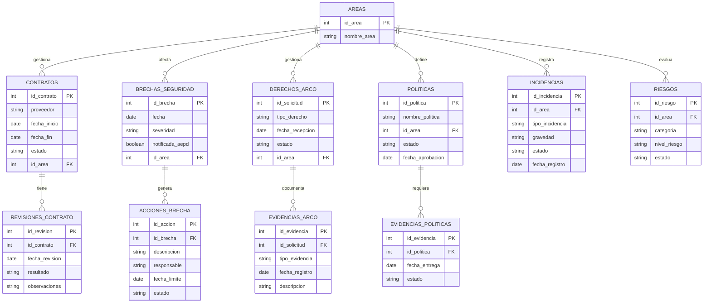

# 📊 Sistema de Gobernanza y Cumplimiento Legal

## 🧠 Descripción

Modelo de base de datos relacional orientado a la **gestión de gobernanza, cumplimiento legal y control de riesgos**, integrando contratos, políticas, incidencias, brechas de seguridad, derechos ARCO y evidencias.

Permite análisis, trazabilidad y auditoría mediante SQL en un entorno corporativo.

---

## 🧩 Diagrama del modelo (ERD)



---

## 🧠 Interpretación del modelo

* **AREAS** es la tabla central (equivalente a departamentos)

* Cada área gestiona:

  * contratos
  * riesgos
  * incidencias
  * políticas
  * solicitudes ARCO

* Relaciones clave:

  * Un contrato tiene múltiples revisiones
  * Una brecha genera múltiples acciones
  * Una solicitud ARCO tiene múltiples evidencias
  * Una política tiene evidencias de cumplimiento

---

## 🔍 Casos de uso del modelo

Este sistema permite responder preguntas como:

* ¿Qué áreas tienen más riesgos abiertos?
* ¿Existen brechas críticas sin acciones correctivas?
* ¿Hay solicitudes ARCO sin evidencia?
* ¿Qué contratos presentan problemas legales?
* ¿Qué políticas no tienen evidencia de cumplimiento?

---

## 🚀 Ejemplo de consulta

```sql
SELECT a.nombre_area, COUNT(*) AS riesgos_altos
FROM riesgos r
JOIN areas a ON r.id_area = a.id_area
WHERE r.nivel_riesgo = 'Alto'
AND r.estado != 'Cerrado'
GROUP BY a.nombre_area;
```

---

## 💼 Aplicación real

Este modelo es aplicable a:

* Compliance corporativo
* Auditoría interna
* Protección de datos (RGPD)
* Gestión de riesgos
* Departamentos legales

---

## 🎯 Valor del proyecto

* Modelado de datos profesional
* Uso de SQL en escenarios reales
* Enfoque en gobernanza y cumplimiento
* Capacidad analítica aplicada a negocio


---

## 👩‍💻 Autor

Jennifer Sanchez Richart — BI & Data aplicada a gobernanza y compliance


